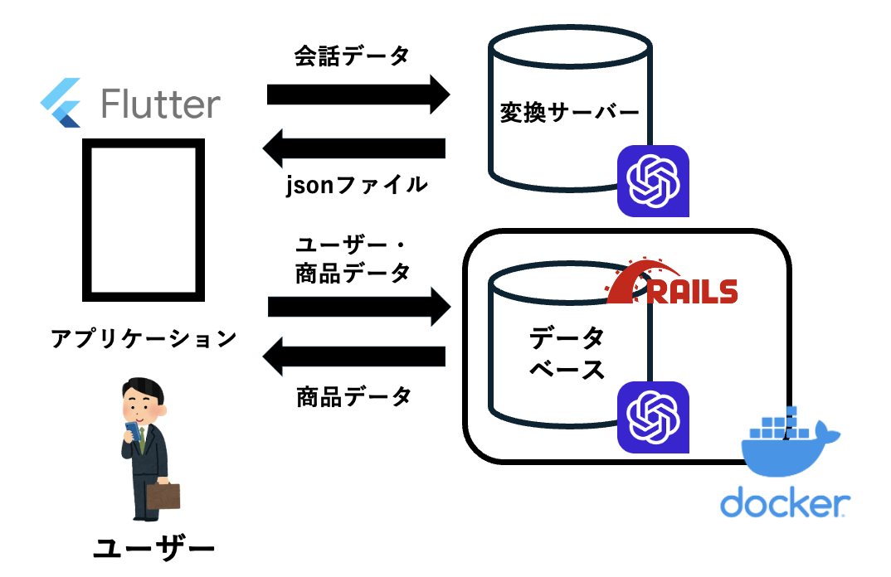

# RegiStock

## 製品概要
音声によるAIとの会話を通して、家にある食品や日用品を管理し、スマホアプリ上で存在の有無や賞味期限を確認するプロダクトです.

### 背景(製品開発のきっかけ、課題等）
「冷蔵庫の食べ物の賞味期限が切れちゃった」
「いま家に卵あったっけ？」
「シャンプー切らしてるの忘れてた…」

**だけど**、いちいちメモしておくのもめんどくさいなあ…

そんな私たち、だらしない大学生をはじめとした多くの人の悩みに応える  
手軽でなんでもできる家の物管理アプリがつくりたいと思い、本プロダクトを制作しました.

### 製品説明（具体的な製品の説明）
本プロダクトは、スマホアプリを使うユーザーとLLMを持つ2つのサーバーにより動作します.

ユーザーはスマホアプリ上で、

**「こんにちは。今日は青森県のりんごを買ったんだ。」**  

**「おお、青森県産のりんごね。d」**  

のように会話をしていきます.　　

この会話データを読み取り用に設定した別のAIに渡し、 買った物を適切なjson形式のデータに変換します.  
そうして生成されたデータをデータベースに送ることで、アプリケージョン上で確認することができるようになります.

### 特長
#### 1. 私たちの生活の悩みを直接解決する
食品の賞味期限切れや、今家に何があるかよくわからないといった悩みは誰しもが経験したことのあることだと思います。  
このような人の小さな悩みを解消することがプロダクトの魅力になると考えています.

#### 2. 音声入力
既に存在するような食品、日用品管理アプリの多くは、 時間のかかる物の登録作業や毎回写真を撮る作業を要し、  
ユーザーにストレスを与えてしまいます. 事実上これらのアプリは几帳面な人のための道具になっています.  
本当にものの管理に困っている大雑把な人々に利用してもらうために、   
入力を最小限に直感的に行うことが必要であると考え、会話形式で楽しみながら,ストレスなく登録をする機能を実装しました.  

#### 3. 大規模言語モデル (LLM) の活用
大規模言語モデルには多くの可能性があると考え、今回のプロダクトでは会話とデータ変換の2つの部分で生成AIとしてChatGPTを利用しました.    
アプリ上でユーザーと対話するAIには ”fine tuning” を活用して会話を楽しめるような工夫を、  
データ変換を行うAIは、従来難しかった小さな会話データから適切な json 形式のデータの生成が可能になり、なんでも登録できる汎用性も持ちます.  

### 解決出来ること
本プロダクトにより、従来ものの管理が面倒でやっていなかった人に対しても、手軽にものを管理をすることが可能になったこと.  

### 今後の展望
データ形式や各種APIも今後さまざまな利用可能性のために、注意をして整備した.  
データ利用の例として、食品データからのレシピ提案、会話ベースのよるデータを操作を実現したい.  
さらにより直感的な入力を追求していきたい.   
あらゆる操作が会話だけでできるようになり、スマホアプリの枠組みを越え、スマートスピーカーに搭載されるようなものを実現したい.   

### 注力したこと（こだわり等）
* 当日まで、ひたすら私たちが使いたいと思う、熱量を持って取り組めるアイデアを考え続けたこと.  
* 大規模言語モデルを単なる生成による会話ではなく、 データ整形のツールとしても取り入れたこと.  
* ３人で１から取り組むにはフロントからバックエンド、AIの利用等比較的規模の大きなプロダクトであると感じたが、完成目前まで実装できたこと.

## 開発技術
### 活用した技術
#### API・データ
* OpenAI API
  
#### フレームワーク・ライブラリ・モジュール
* Rails
* Flutter
* 音声入力　**https://github.com/belcrod5/Speak-Chat**
 
#### デバイス
* Android
  
### 独自技術
#### ハッカソンで開発した独自機能・技術
* バックエンドのレポジトリ
  
  APIの整備を丁寧にやることを試みました

* 特に力を入れた部分をファイルリンク、またはcommit_idを記載してください。
  [フロント](https://github.com/jphacks/sd_2405/tree/dev)
  表はFlutterで音声入力とfine tuningとうLLM周りの処理を作成した
